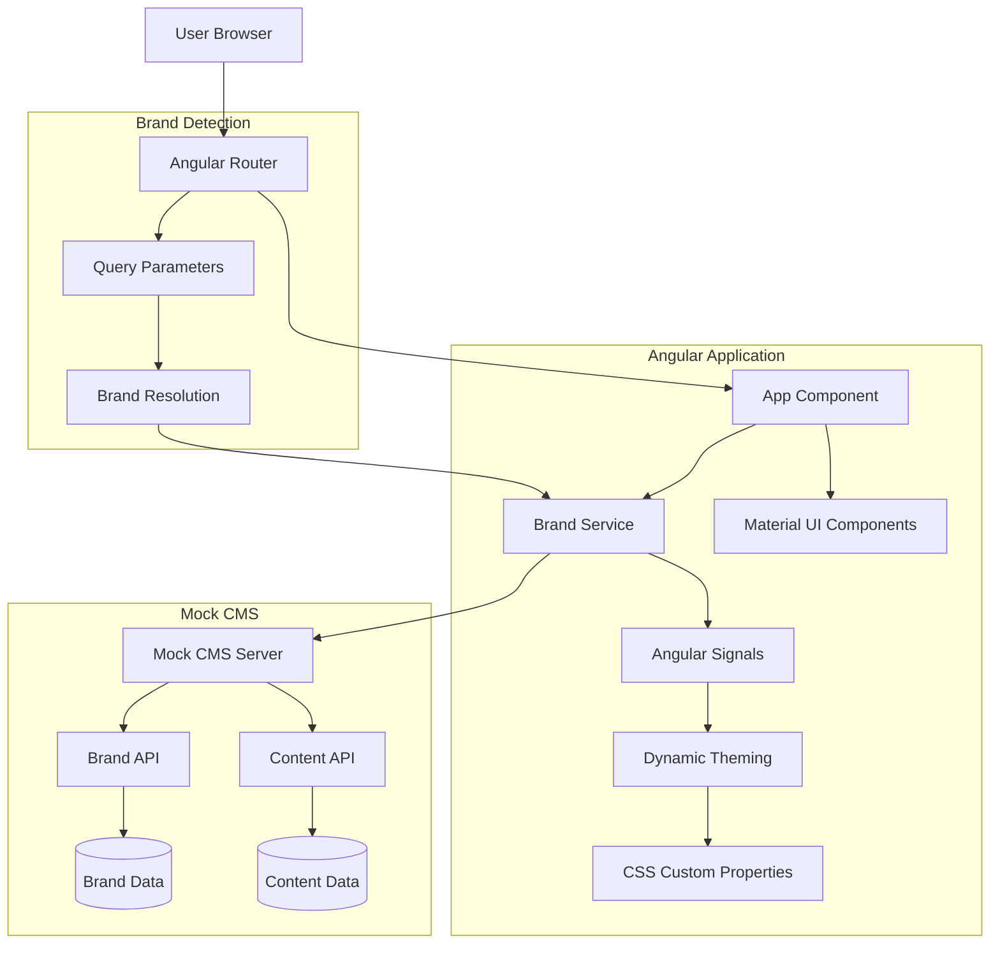
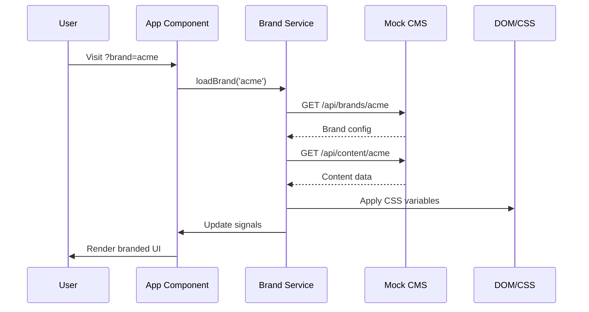

# Multi-Brand Angular Architecture

## System Overview

## Data Flow

## Key Components

### 1. Brand Service
- **Purpose**: Central brand management
- **Technology**: Angular Signals for reactive state
- **Responsibilities**:
  - Fetch brand configuration from CMS
  - Apply dynamic theming via CSS custom properties
  - Manage brand-specific content

### 2. Dynamic Theming
- **Method**: CSS custom properties + Angular Material
- **Benefits**: Runtime theme switching without rebuilds
- **Implementation**: CSS variables updated via JavaScript

### 3. Mock CMS
- **Technology**: Express.js server
- **Endpoints**:
  - `GET /api/brands/:id` - Brand configuration
  - `GET /api/content/:brandId` - Brand-specific content
- **Data**: JSON responses with colors, logos, text, images

## Brand Routing Strategy

Current implementation uses query parameters:
- `?brand=acme` → ACME Corp branding
- `?brand=globex` → Globex Industries branding

Alternative approaches:
- Subdomain routing: `acme.example.com`
- Path-based routing: `/acme/home`
- Header-based detection

## Technology Choices

### Angular Signals vs RxJS
- **Chosen**: Angular Signals
- **Reason**: Simpler state management, better performance
- **Alternative**: RxJS Observables for complex async operations

### CSS Custom Properties vs SCSS Variables
- **Chosen**: CSS Custom Properties
- **Reason**: Runtime theme switching capability
- **Alternative**: SCSS with build-time compilation

### Standalone Components vs NgModules
- **Chosen**: Standalone Components
- **Reason**: Angular 17 best practice, simpler dependency management