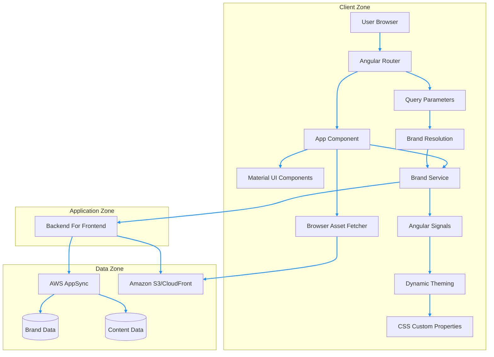
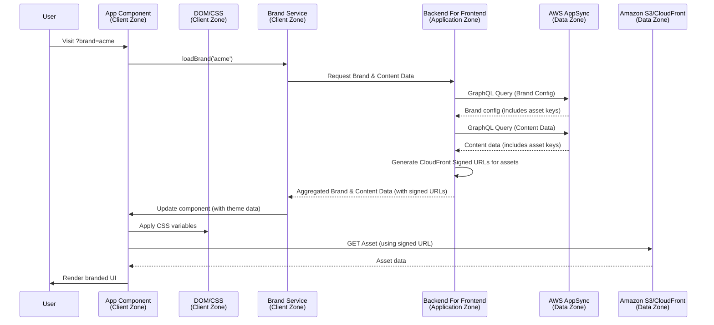

# Multi-Brand Angular Architecture

## System Overview

## Data Flow

## Key Components

### 1. Brand Service
- **Purpose**: Central brand management and data orchestration
- **Technology**: Angular Signals for reactive state
- **Responsibilities**:
  - Fetch brand configuration and content data via BFF
  - Provide aggregated brand and content data (including signed asset URLs) to components

### 2. Dynamic Theming
- **Method**: CSS custom properties + Angular Material
- **Benefits**: Runtime theme switching without rebuilds
- **Implementation**: CSS variables applied by the App Component (or a dedicated theming component) via host bindings.

### 3. Backend For Frontend (BFF)
- **Technology**: Node.js with Express.js (example)
- **Purpose**: Securely aggregate and transform data for the frontend.
- **Endpoints**: Unified API endpoint for brand and content data.
- **Responsibilities**:
  - Authenticate and authorize requests from the client.
  - Orchestrate calls to AWS AppSync for structured data.
  - Generate CloudFront Signed URLs for assets from S3/CloudFront.
  - Aggregate and transform data into a format optimized for the frontend.

### 4. AWS AppSync
- **Purpose**: Real-time GraphQL API for structured content delivery.
- **Role**: Provides brand configuration and content metadata.

### 5. Amazon S3/CloudFront
- **Purpose**: Scalable and performant storage and delivery of media assets.
- **Role**: Stores and delivers images (logos, hero images) via CloudFront Signed URLs.

## Brand Routing Strategy

Current implementation uses query parameters:
- `?brand=acme` → ACME Corp branding
- `?brand=globex` → Globex Industries branding

Alternative approaches:
- Subdomain routing: `acme.example.com`
- Path-based routing: `/acme/home`
- Header-based detection

## Technology Choices

### Angular Signals vs RxJS
- **Chosen**: Angular Signals
- **Reason**: Simpler state management, better performance
- **Alternative**: RxJS Observables for complex async operations

### CSS Custom Properties vs SCSS Variables
- **Chosen**: CSS Custom Properties
- **Reason**: Runtime theme switching capability
- **Implementation**: CSS variables are dynamically updated by the App Component (or a dedicated theming component) via host bindings.
- **Alternative**: SCSS with build-time compilation

### Standalone Components vs NgModules
- **Chosen**: Standalone Components
- **Reason**: Angular 17 best practice, simpler dependency management